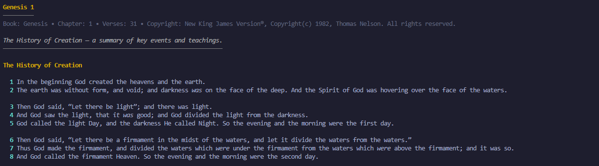

# Bible CLI/TUI - *Powered by API.Bible*

[](https://pixi.sh)
[](https://github.com/astral-sh/ruff)

---

### Install

#### Clone the repository, and then

*with uv*

```console
uv tool install .
```

*with pipx*

```console
pipx install .
```

---

### Run as a CLI

```console
bible-cli book chapter Genesis 1 
```



### Run as a TUI

```console
bible-tui
```


---

### Requirements

- An API key from [API Bible][api-bible]

### Configure

Example .env:

```env
BIBLE_API_KEY="<api-key>"
BIBLE_BIBLE_NAME="New King James Version"
BIBLE_BOOK_NAME='Genesis'
BIBLE_ENDPOINT='https://rest.api.bible'
BIBLE_THEME="onyx-light"
```

> Note, although cache expiry days is configurable it should NOT be set above 30 days, as per the terms and conditions of the API. See [Acceptable Use][acceptable-use]

---

[api-bible]: https://api.bible
[acceptable-use]: https://api.bible/terms-and-conditions#acceptable_use