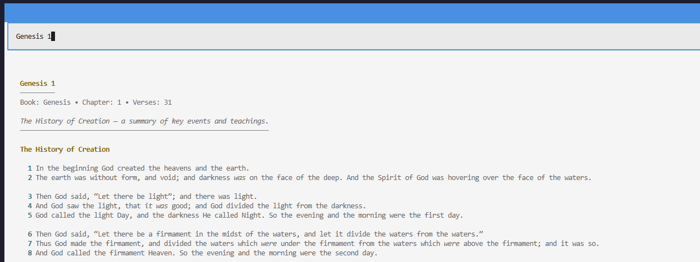

# Bible CLI/TUI - *Powered by API.Bible*

[](https://pixi.sh)
[](https://github.com/astral-sh/ruff)

---

### Requirements

- An API key from [API.Bible][api-bible]

---

### Install

#### Clone the repository, and then

*with uv*

```console
uv tool install .
```

*with pipx*

```console
pipx install .
```

---

### Run as a CLI

```console
bible-cli book chapter Genesis 1 
```


```console
bible-cli book verse John 1 1
```


### Run as a TUI

```console
bible-tui
```



---

### Configure

#### Environment Variables

The bible app will look for an environments file in the following locations:
- .env in the current working directory
- \<user home directory> / .config / bible / config.env

Example .env:

```env
BIBLE_API_KEY="<api-key>"
BIBLE_CACHE_EXPIRY_DAYS=30
BIBLE_DB_PATH="<user home directory>/.cache/bible/bible_cache.db"

BIBLE_CLI_BIBLE_NAME="New King James Version"
BIBLE_CLI_BOOK_NAME='Genesis'
BIBLE_CLI_LOG_LEVEL="info"

BIBLE_TUI_BIBLE_NAME="New King James Version"
BIBLE_TUI_BOOK_NAME='Genesis'
BIBLE_TUI_THEME="catppuccin-mocha"
BIBLE_TUI_LOG_LEVEL="info"
```

> Note, although cache expiry days is configurable it should NOT be set above 30 days.
>
> See [Acceptable Use][acceptable-use]

---

### Supported Bibles

The Bible versions I have tested are:

-   New King James Version
-   New International Version 2011

A generic renderer has been added but since each Bible has its own markup differences it's better to implement a Bible specific renderer.

---

[api-bible]: https://api.bible
[acceptable-use]: https://api.bible/terms-and-conditions#acceptable_use